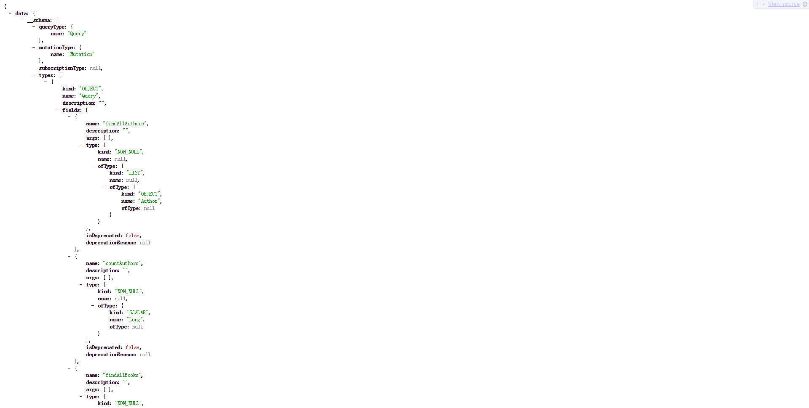
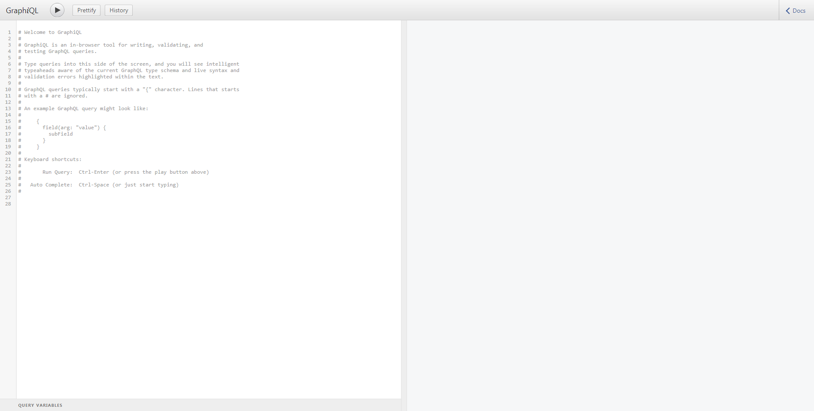
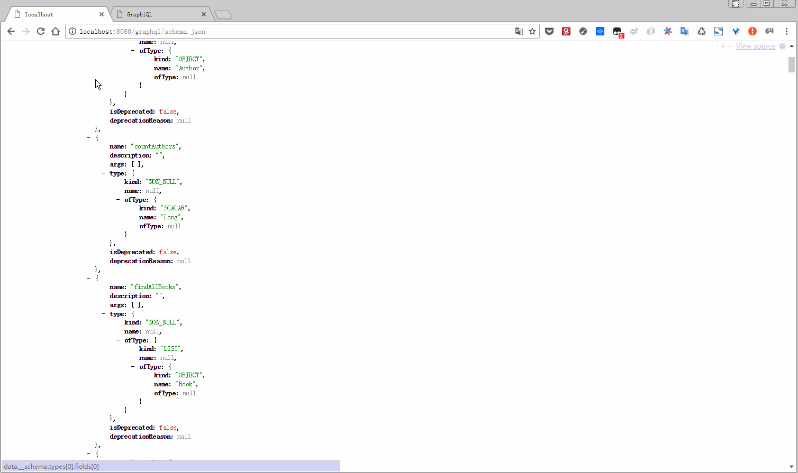
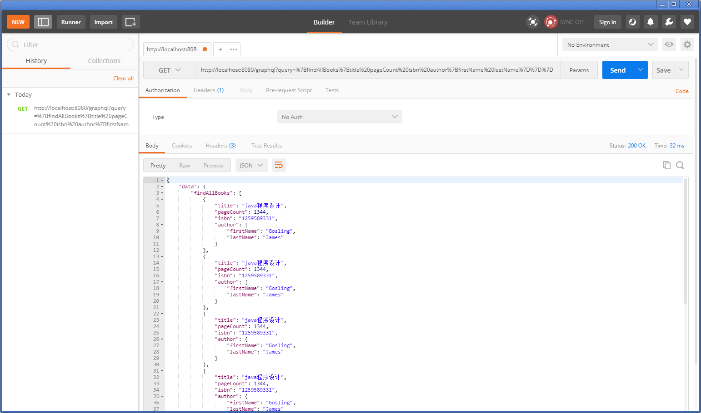
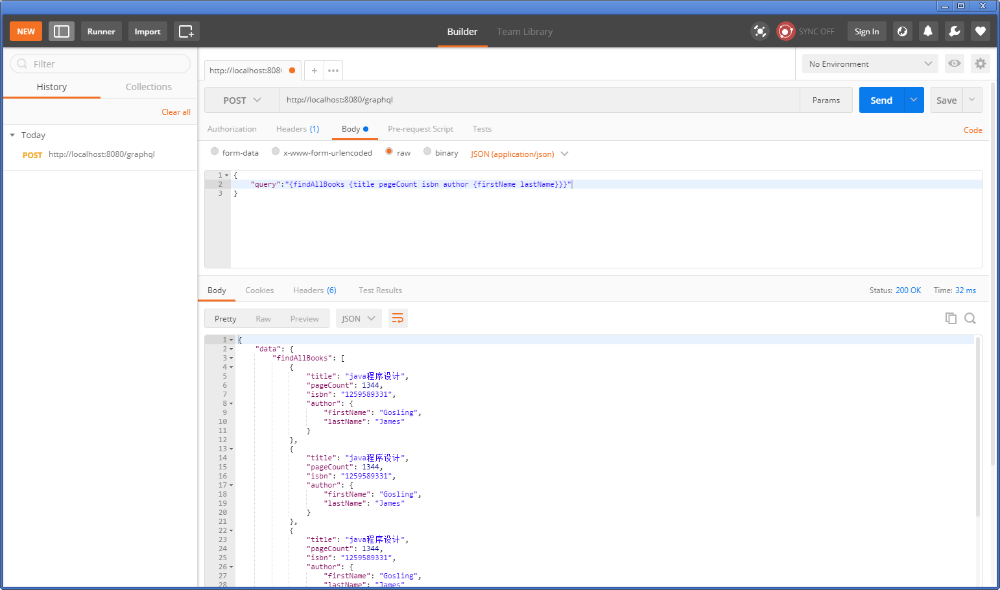
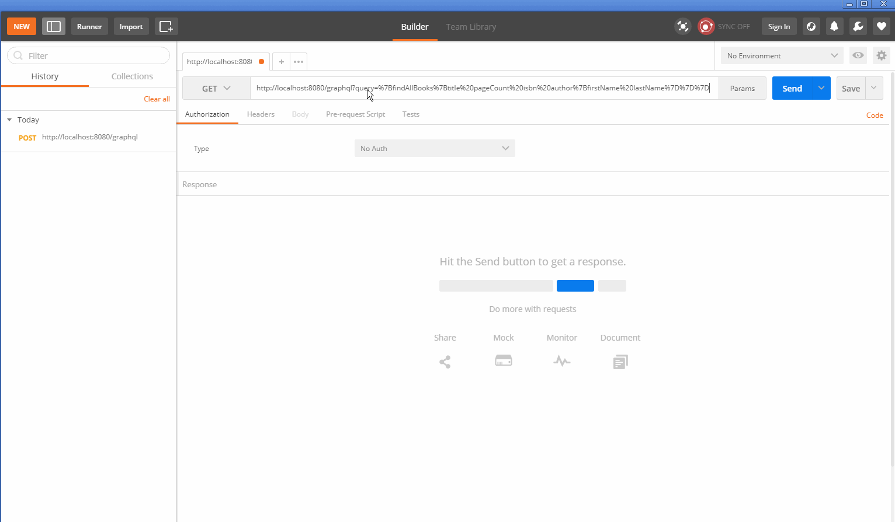

# graphql-example

* GraphQL Schema

http://localhost:8080/graphql/schema.json

* GraphiQL

http://localhost:8080/graphiql

* 操作演示

GraphiQL操作演示

Postman操作演示

GET方式

`
http://localhost:8080/graphql?query={findAllBooks{title pageCount isbn author{firstName lastName}}}
`

对原字符串`{findAllBooks{title pageCount isbn author{firstName lastName}}}`进行`UrlEncode`编码

`
http://localhost:8080/graphql?query=%7BfindAllBooks%7Btitle%20pageCount%20isbn%20author%7BfirstName%20lastName%7D%7D%7D
`

POST方式直接提交json

`GraphiQL`中查询语法为：

`
{
  findAllBooks {
    title
    pageCount
    isbn
    author {
      firstName
      lastName
    }
  }
}
`

`Postman`中查询语法为:

`
{
    "query":"{findAllBooks {title pageCount isbn author {firstName lastName}}}"
}`

提交的url仍为 http://localhost:8080/graphql

操作演示

参考文档

https://www.pluralsight.com/guides/java-and-j2ee/building-a-graphql-server-with-spring-boot

https://blog.pusher.com/writing-graphql-service-using-kotlin-spring-boot
